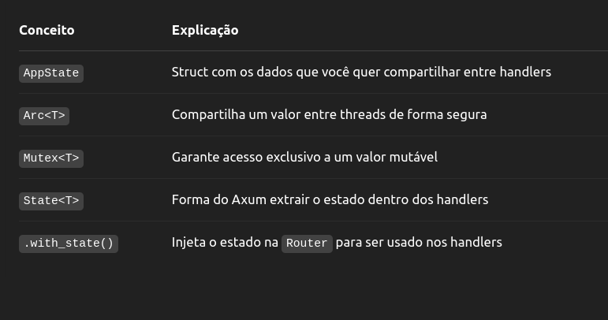

# habit-tracker

### Extractors: 

O que é Json<T>?

O Axum fornece esse extrator genérico Json<T> que:

    - Lê o corpo da requisição HTTP.

   -  Tenta converter (desserializar) esse corpo para o tipo T usando serde.

   -  No seu caso, T é CreateHabit, ou seja:

### App State: 
